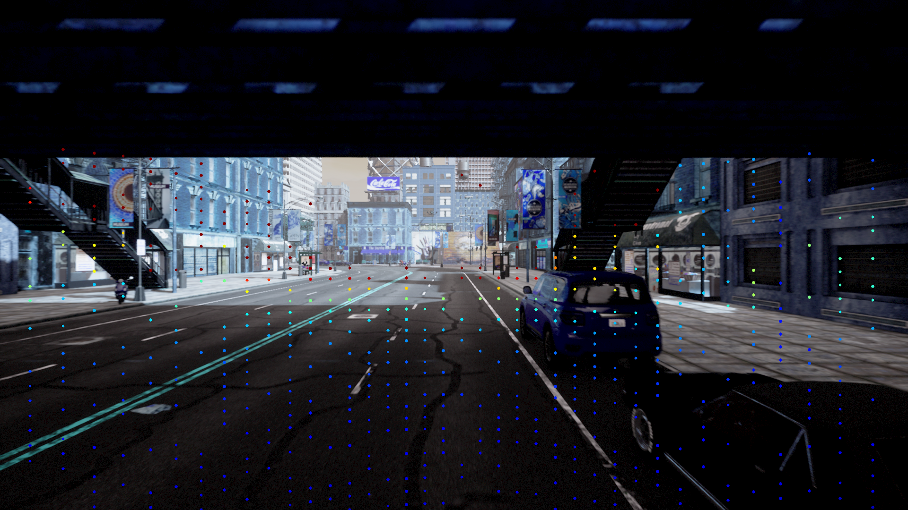

# ads_pipeline

Autonomous Driving Sensor Pipeline for the CARLA Simulator.

This ROS 2 package connects to a running CARLA server, spawns an ego vehicle, attaches a multi-modal sensor suite, publishes all sensor data as typed ROS 2 messages, and projects LiDAR point clouds onto camera images in real time.

---

## Table of Contents

- [Overview](#overview)
- [Package Structure](#package-structure)
- [Prerequisites](#prerequisites)
- [Building](#building)
- [Configuration](#configuration)
- [Running](#running)
- [LiDAR-to-Camera Projection](#lidar-to-camera-projection)
- [Published Topics](#published-topics)
- [Recorded Data](#recorded-data)
- [Relationship to carla\_ros2\_bridge](#relationship-to-carla_ros2_bridge)

---

## Overview

The pipeline follows a two-stage workflow:

```
CARLA Simulator
      │
      │  (TCP connection on port 2000)
      ▼
SensorManager Node  ──────────────────────────────────────────────────────
  │  Spawns ego vehicle (Tesla Model 3) with autopilot                    │
  │  Attaches sensors:                                                     │
  │    ├── RGB Camera  ──► /carla/camera/rgb/image  (sensor_msgs/Image)   │
  │    ├── LiDAR       ──► /carla/lidar/points      (sensor_msgs/PointCloud2)
  │    └── IMU         ──► /carla/imu/data          (sensor_msgs/Imu)    │
  └──────────────────────────────────────────────────────────────────────┘
                    │                          │
                    ▼                          ▼
           ros2 bag record            ProjectionNode
      ~/recorded_sensor_bag/     (LiDAR onto camera overlay
  sensor_bag_<YYYYMMDD_HHMMSS>/   saved to ~/results/)
```

1. **CARLA** provides the simulation environment and sensor ground truth.
2. **`SensorManager`** bridges CARLA sensor callbacks to typed ROS 2 messages and publishes them at the rates defined in `config/config_carla.yaml`.
3. **`ProjectionNode`** subscribes to both `/carla/lidar/points` and `/carla/camera/rgb/image`, projects 3-D LiDAR points onto the image plane with depth-colorized dots, and saves the overlay to `~/results/projection_result.png`.
4. **`ros2 bag record`** (launched via `record_launch.py`) subscribes to all three topics and writes them to a timestamped bag directory.

---

## Package Structure

```
ads_pipeline/
├── ads_pipeline/
│   ├── sensor_manager.py        # SensorManager ROS 2 node
│   ├── projection_Lidar_cam.py  # ProjectionNode — LiDAR-to-camera overlay
│   └── lidar_projection.py      # Projection math library (K, T, colorize, overlay)
├── config/
│   └── config_carla.yaml        # Sensor parameters and topic names
├── launch/
│   ├── sensor_launch.py         # Launches SensorManager only
│   └── record_launch.py         # Launches SensorManager + bag recorder
├── docs/
│   └── projection_result.png    # Sample LiDAR-on-camera overlay
├── rviz/
│   └── ads_pipeline.rviz        # RViz2 configuration for live visualization
├── package.xml
├── setup.py
└── setup.cfg
```

---

## Prerequisites

| Dependency | Version |
|---|---|
| ROS 2 | Humble (Ubuntu 22.04) or Jazzy (Ubuntu 24.04) |
| CARLA Simulator | 0.9.13+ |
| `carla` Python package | matching CARLA server version |
| `cv_bridge` | from `ros-<distro>-cv-bridge` |
| `ros2_numpy` | for structured PointCloud2 deserialization |
| `opencv-python` | for image processing and colormap |
| `sensor_msgs`, `std_msgs` | standard ROS 2 packages |

CARLA must be running and reachable at `localhost:2000` before launching this package.

---

## Building

From the workspace root:

```bash
cd ~/carla_ws
colcon build --packages-select ads_pipeline
source install/setup.bash
```

---

## Configuration

All sensor parameters are centralized in `config/config_carla.yaml`:

```yaml
sensor_manager:
  ros__parameters:
    # RGB Camera
    camera.width: 1920
    camera.height: 1080
    camera.fov: 90

    # LiDAR
    range: 100
    channels: 32
    points_per_second: 100000
    rotation_frequency: 20

    # IMU
    imu_update_rate: 100

    # Topic names
    camera_topic: /carla/camera/rgb/image
    lidar_topic:  /carla/lidar/points
    imu_topic:    /carla/imu/data

    # Vehicle
    vehicle_blueprint: vehicle.tesla.model3
```

Parameters can also be overridden at launch time via `--ros-args -p` without editing the YAML.

---

## Running

### Sensor node only

```bash
ros2 launch ads_pipeline sensor_launch.py
```

Optional arguments:

| Argument | Default | Description |
|---|---|---|
| `host` | `localhost` | CARLA server host |
| `port` | `2000` | CARLA server port |
| `spawn_index` | `6` | Ego vehicle spawn point index |

### Full pipeline (sensor node + bag recorder)

```bash
ros2 launch ads_pipeline record_launch.py
```

Stop with `Ctrl+C`. Both processes terminate cleanly and the bag is finalized automatically.

### LiDAR-to-camera projection node

With the sensor node running, start the projection node in a second terminal:

```bash
ros2 run ads_pipeline projection_node
```

The overlay image is written to `~/results/projection_result.png` on every camera frame.

### Live visualization in RViz2

```bash
rviz2 -d ~/carla_ws/src/Autonomous_driving_Carla_simulator/ads_pipeline/rviz/ads_pipeline.rviz
```

---

## LiDAR-to-Camera Projection

The projection pipeline is split across two files:

### `lidar_projection.py` — math library

| Function | Description |
|---|---|
| `build_intrinsic_matrix(w, h, fov_deg)` | Computes the 3×3 pinhole camera matrix **K** from image dimensions and horizontal FOV |
| `build_extrinsic(lidar_loc, camera_loc)` | Builds the 4×4 rigid-body transform **T** from LiDAR to camera frame (translation only; assumes co-planar sensors with no rotation offset) |
| `projection_lidar_to_image(points_xyz, K, T, w, h)` | Projects pre-transformed 3-D points onto the image plane; returns `(u, v)` pixel coordinates and per-point depth values |
| `colorize_depth(depth, max_depth)` | Maps depth values to BGR colors using OpenCV's JET colormap |
| `overlay_projection(image_bgr, pixels, colors)` | Draws depth-colored filled circles onto the BGR image |

### `projection_Lidar_cam.py` — ROS 2 node

`ProjectionNode` subscribes to the LiDAR and camera topics independently, caches the latest message from each, and triggers projection on every incoming camera frame.

**Coordinate conversion** — CARLA uses a left-handed coordinate system. Before projection the node remaps each LiDAR point:

```
camera_X =  CARLA_Y
camera_Y = -CARLA_Z
camera_Z = -CARLA_X   (depth / forward)
```

After the remap, `T_cam_lidar = I` (identity) because the coordinate conversion already accounts for the sensor offset at the default mount positions.

**Default sensor mounts (vehicle-relative):**

| Sensor | Location (x, y, z) |
|---|---|
| RGB Camera | (1.5, 0.0, 2.4) |
| LiDAR | (0.0, 0.0, 2.5) |

**Projection result:**



*Depth-colorized LiDAR points (JET colormap, max depth 50 m) overlaid on the 1920×1080 front RGB camera. Blue = far, red = near.*

---

## Published Topics

| Topic | Message Type | Description |
|---|---|---|
| `/carla/camera/rgb/image` | `sensor_msgs/Image` | 1920×1080 RGB front camera, 90° FOV |
| `/carla/lidar/points` | `sensor_msgs/PointCloud2` | 32-channel ray-cast LiDAR, 100 m range, `x y z intensity` fields |
| `/carla/imu/data` | `sensor_msgs/Imu` | Linear acceleration and angular velocity from CARLA's IMU |

All messages carry a `header.stamp` set from the ROS 2 clock at callback time.

---

## Recorded Data

Bag files are written to:

```
~/recorded_sensor_bag/sensor_bag_<YYYYMMDD_HHMMSS>/
```

Each bag captures the three topics listed above. To inspect a recording:

```bash
ros2 bag info ~/recorded_sensor_bag/sensor_bag_<timestamp>
ros2 bag play ~/recorded_sensor_bag/sensor_bag_<timestamp>
```

---

## Relationship to `carla_ros2_bridge`

The sibling package `carla_ros2_bridge` (located at `src/carla_ros2_bridge/`) contains the earlier exploratory scripts that informed the design of `ads_pipeline`:

| Script | Purpose |
|---|---|
| `camera_publisher.py` | Prototype ROS 2 node — camera, camera info, and odometry publishing with coordinate-frame corrections (CARLA left-handed → ROS right-handed). |
| `spawn_Attach_vehicle_sensor.py` | Standalone (non-ROS) script used to validate sensor attachment, LiDAR callbacks, and a LiDAR-to-camera projection algorithm. |
| `explore_maps.py` | Utility for inspecting available CARLA maps, waypoints, and road IDs. |
| `weather_experiment.py` | Snapshot tool for testing weather presets (e.g., `HardRainNoon`) and camera output. |

`ads_pipeline` consolidates the sensor-publishing logic from these prototypes into a single parameterized ROS 2 node with a unified launch, recording, and real-time projection workflow.
